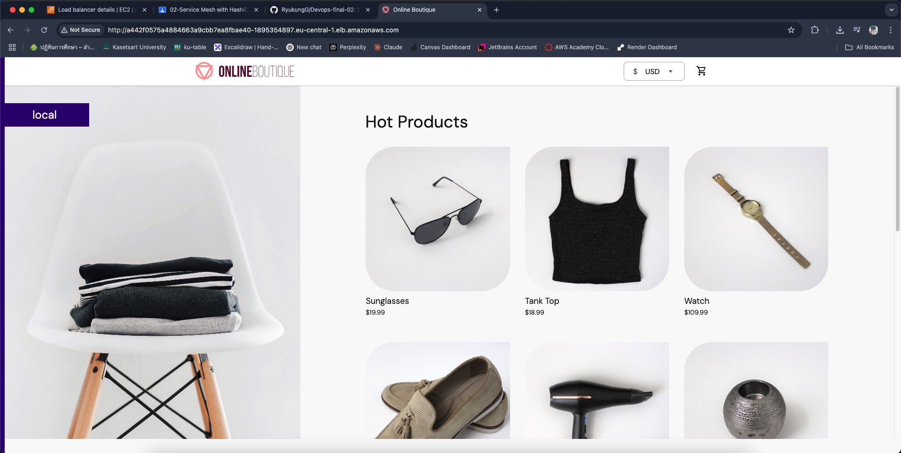
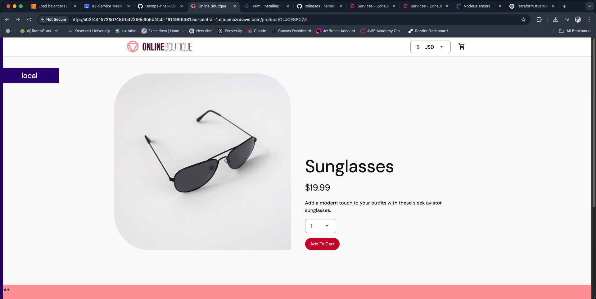
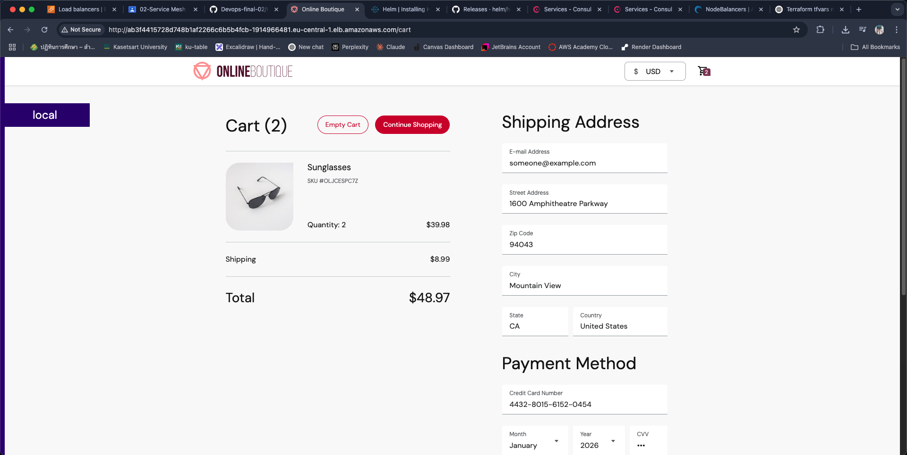

# Service Mesh with HashiCorp Consul
This repository is part of DevOps and Microservices course.  
  
Demo project accompanying a [Consul crash course video](https://www.youtube.com/watch?v=s3I1kKKfjtQ) on YouTube

### Terraform commands to execute the script

```sh
# initialise project & download providers
terraform init

# preview what will be created with apply & see if any errors
terraform plan

# exeucute with preview
terraform apply -var-file terraform.tfvars

# execute without preview
terraform apply -var-file terraform.tfvars -auto-approve

# destroy everything
terraform destroy

# show resources and components from current state
terraform state list
```

#### Get access to EKS cluster
```sh
# install and configure awscli with access creds
aws configure

# check existing clusters list
aws eks list-clusters --region eu-central-1 --output table --query 'clusters'

# check config of specific cluster - VPC config shows whether public access enabled on cluster API endpoint
aws eks describe-cluster --region eu-central-1 --name myapp-eks-cluster --query 'cluster.resourcesVpcConfig'

# create kubeconfig file for cluster in ~/.kube
aws eks update-kubeconfig --region eu-central-1 --name myapp-eks-cluster

# test configuration
kubectl get svc
```

### 📂 Kubernetes
`config.yaml` -> It sets up the deployments and services for the online store without annotations.
`config-consul.yaml` -> A configuration file that is applied when Consul has been deployed to the cluster.  It defines the online store's deployments and services, as well as annotations enabling for service discovery via metadata.
`consul-values.yaml` ->  Contains the values required for installing Consul using Helm charts.
`consul-mesh-gateway.yaml` -> YAML definition for deploying a Consul Mesh Gateway (for cross-datacenter).
`exported-service.yaml` -> Declares a Kubernetes service to be exported across meshes or datacenters via Consul.
`service-resolver.yaml` -> Configures the Linode service as a backup or failover option for the same service running on EKS.

### 📂 Terraform
`main.tf` -> Main entry point for your Terraform setup, likely combining all modules and resources.
`providers.tf` -> Declares providers (e.g., AWS, Helm, Kubernetes) and authentication credentials.
`variables.tf` -> Declares all variables (types, defaults) that can be set in `terraform.tfvars`.
`terraform.tfvars` -> Supplies variable values (e.g., aws_access_key_id, region) for use in variables.tf.

### Screenshorts of the Service Interface



